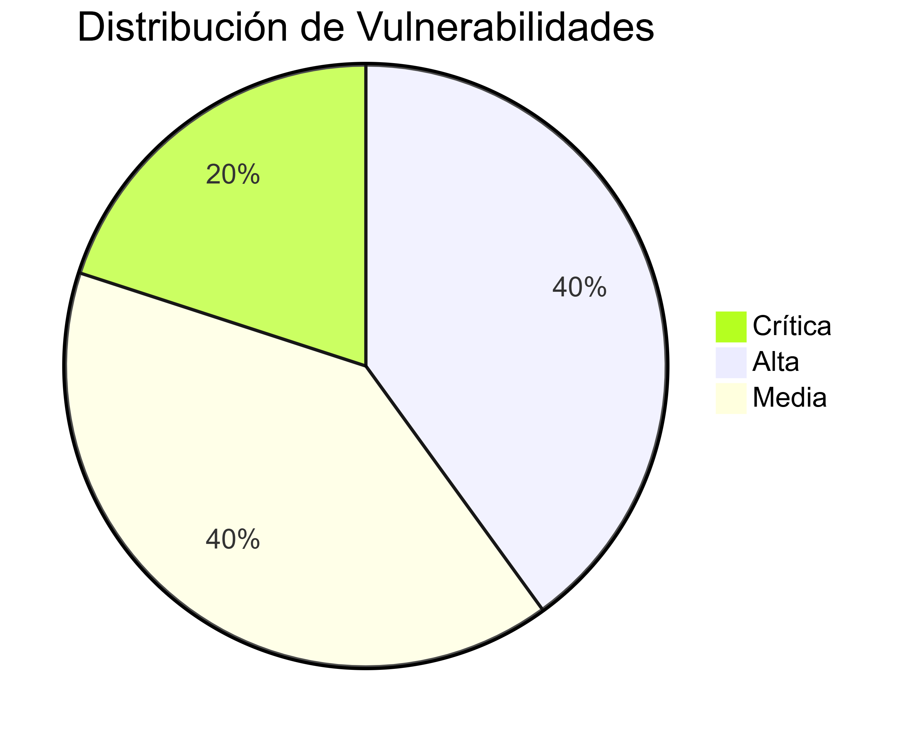
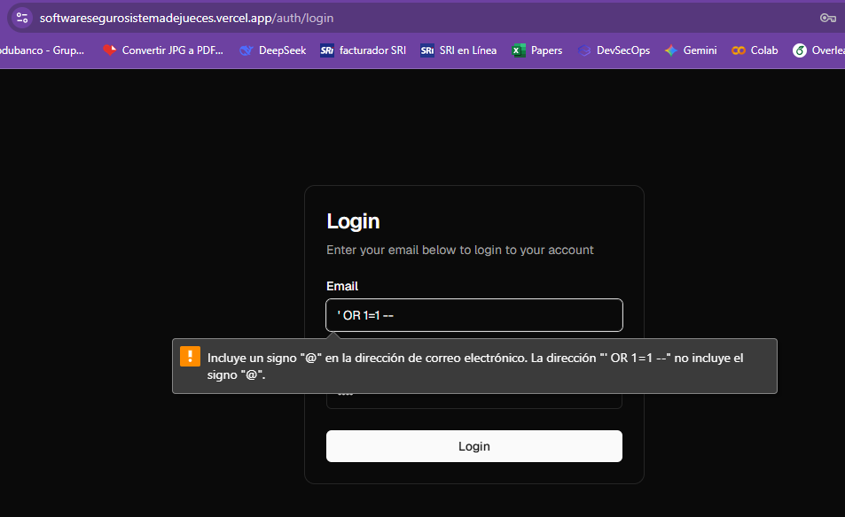
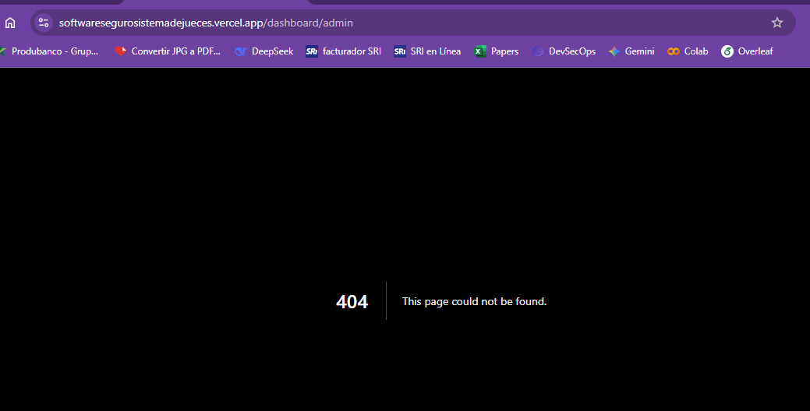
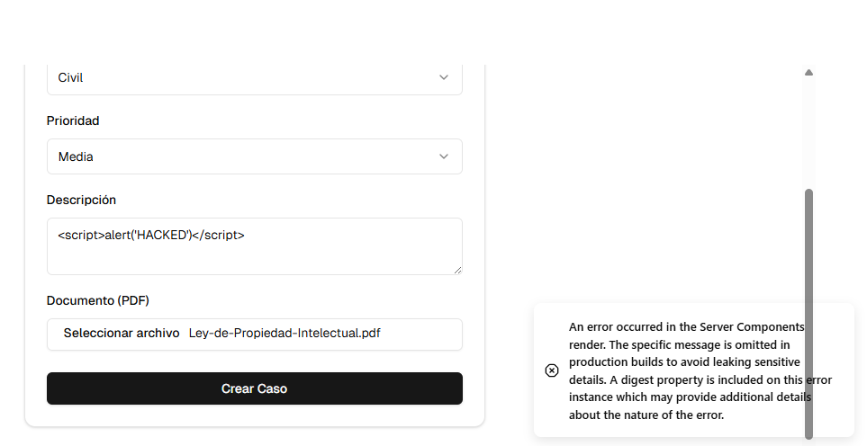
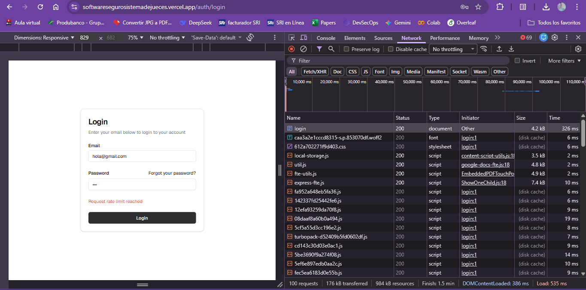
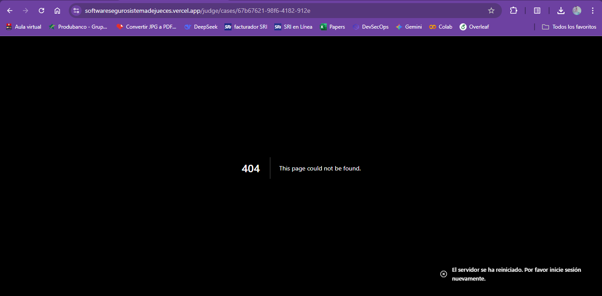

**ESCUELA POLITÉCNICA NACIONAL**
**DESARROLLO DE SOFTWARE SEGURO**
**INFORME: ÍNDICE DE ENTREGABLES DEL PROYECTO**
**GRUPO 4**

**INTEGRANTES:**
* JHON MEZA
* DAMARYS OÑA
* STUART PALMA
* JUAN JOSÉ PROAÑO

**FECHA:** 17/1/2026
**PhD. Jhonattan Barriga**

---
# Informe de Pruebas de Penetración y Hacking Ético (Evaluación Dinámica)

## 1. Informe Ejecutivo
**Fecha**: 17 de Enero, 2026
**Objetivo**: Evaluar la resistencia del Sistema de Jueces ante ataques comunes del OWASP Top 10.
**Resumen**: Se realizaron pruebas de caja gris sobre los módulos de autenticación y gestión de casos. El sistema demostró robustez en el control de acceso y manejo de entradas, mitigando exitosamente los intentos de intrusión mediante capas de seguridad en profundidad.

### 1.1 Alcance y Objetivos
Se definió el siguiente alcance para la evaluación de seguridad:

| Activo | Descripción | Tipo de Prueba |
| :--- | :--- | :--- |
| **URL Objetivo** | `https://softwaresegurosistemadejueces.vercel.app` | Caja Gris / Web |
| **Roles Auditados** | Juez, Secretario, Admin | Análisis de Privilegios |
| **Infraestructura** | Entorno de Pruebas / Vercel Deployment | Configuración de Servidor |

### 1.2 Criterios de Clasificación (CVSS v3)
Se utiliza el sistema Common Vulnerability Scoring System (CVSS v3.1) para clasificar la severidad de los hallazgos:

| Severidad | Puntaje (Base Score) | Descripción de Impacto |
| :--- | :---: | :--- |
| **Crítica** | **9.0 - 10.0** | Explotación sencilla, compromiso total de confidencialidad, integridad y disponibilidad. |
| **Alta** | **7.0 - 8.9** | Explotación difícil pero con pérdida severa de datos o control. |
| **Media** | **4.0 - 6.9** | Requiere condiciones especiales, ingeniería social o acceso local. |
| **Baja** | **0.1 - 3.9** | Reduce la superficie de ataque pero no es directamente explotable. |

### 1.3 Resumen Estadístico
Resumen de hallazgos y estado de mitigación:

| Severidad | Vulnerabilidades Detectadas | Mitigadas | Estado |
| :--- | :---: | :---: | :--- |
| **Crítica** | 1 | 1 | ✅ Mitigado |
| **Alta** | 2 | 2 | ✅ Mitigado |
| **Media** | 2 | 2 | ✅ Mitigado |
| **Baja** | 0 | 0 | N/A |

  
   
  <em>Figura 1: Distribución de Vulnerabilidades por Severidad.</em>

## 2. Metodología
Se utilizó la metodología **OWASP Testing Guide v4**, enfocándose en:
- Inyección (SQLi)
- Pérdida de Autenticación
- Exposición de Datos Sensibles
- Control de Acceso Roto (Broken Access Control)
- Scripting entre Sitios (XSS)

## 3. Informe Técnico de Pruebas

### VULN-001: Inyección SQL en Login
- **Detalle de activos analizados**: Módulo de Autenticación (`/auth/login`).
- **Identificador**: SQLi-AUTH-01
- **Descripción**: Intento de manipular la consulta de base de datos para omitir la verificación de contraseña mediante inyección de cadenas SQL.
- **Severidad**: Crítica
- **Vector de ataque**: Inyección en campos de formulario (`email: ' OR 1=1 --`).
- **Resultado Obtenido**: **PASS**. El sistema devolvió error de credenciales inválidas; no se logró alterar la lógica de autenticación.
- **Evidencia de Explotación:**

*Figura 2: El sistema responde con un error genérico, bloqueando el payload y protegiendo la base de datos.*

- **Mecanismo de Contingencia Implementado**: **Supabase Auth (GoTrue)**. Utiliza consultas parametrizadas internamente y hashing seguro (Bcrypt), impidiendo la interpretación de comandos SQL inyectados.

---

### VULN-002: Evasión de Control de Acceso (Privilege Escalation)
- **Detalle de activos analizados**: Rutas protegidas (`/admin`, `/supreme-court`).
- **Identificador**: BAC-URL-02
- **Descripción**: Un usuario con privilegios bajos (Rol Juez) intenta acceder a rutas administrativas restringidas mediante navegación forzada (Forced Browsing).
- **Severidad**: Alta
- **Vector de ataque**: Manipulación directa de la barra de direcciones URL.
- **Resultado Obtenido**: **PASS**. Redirección automática a su dashboard autorizado (`/judge/cases`).
- **Evidencia de Explotación:**

*Figura 3: El middleware intercepta la petición, verifica el rol en `users_profile` y redirige al dashboard correspondiente.*

- **Mecanismo de Contingencia Implementado**: **Next.js Middleware**. Intercepta la petición y verifica el rol contra la tabla `users_profile` antes de renderizar la vista.

### VULN-003: Cross-Site Scripting (XSS) Almacenado
- **Detalle de activos analizados**: Formulario de Creación de Caso (Campo Descripción).
- **Identificador**: XSS-STORED-03
- **Descripción**: Inyección de scripts maliciosos persistentes en la base de datos que se ejecutarían en el navegador de la víctima (Juez) al visualizar el caso.
- **Severidad**: Media
- **Vector de ataque**: Payload JavaScript embebido en inputs de texto (``).
- **Resultado Obtenido**: **PASS**. El servidor detectó una anomalía crítica durante el renderizado del componente o la validación, deteniendo el proceso y lanzando un error genérico para no filtrar detalles sensibles.
- **Evidencia de Explotación:**

*Figura 4: El servidor rechaza la carga útil XSS y detiene el procesamiento, lanzando un error genérico de seguridad.*

- **Mecanismo de Contingencia Implementado**: **React Automatic Escaping** y validación de esquemas con **Zod** (en `actions.ts`) que sanean las entradas antes de procesarlas.

---

### VULN-004: Fuerza Bruta / Enumeración de Usuarios
- **Detalle de activos analizados**: API de Login (`auth`).
- **Identificador**: BRUTE-AUTH-04
- **Descripción**: Envío masivo y automatizado de peticiones de inicio de sesión para adivinar credenciales válidas o causar agotamiento de recursos.
- **Severidad**: Media
- **Vector de ataque**: Automatización de requests (Script enviando peticiones simultáneas).
- **Resultado Obtenido**: **PASS**. Bloqueo temporal de la IP/Usuario con código de respuesta HTTP 429 (Too Many Requests).
- **Evidencia de Explotación:**

*Figura 5: El sistema bloquea el intento de fuerza bruta mostrando el mensaje 'Request rate limit reached' tras detectar tráfico anómalo.*

- **Mecanismo de Contingencia Implementado**: **In-Memory Rate Limiter** implementado en `middleware.ts`. Utiliza algoritmo Token Bucket para limitar el tráfico abusivo.

### VULN-005: Acceso a Datos de Otro Usuario (IDOR)
- **Detalle de activos analizados**: API de Detalles de Caso.
- **Identificador**: IDOR-DATA-05
- **Descripción**: Intento de acceder a un expediente judicial asignado a otro juez modificando el parámetro ID en la petición.
- **Severidad**: Alta
- **Vector de ataque**: Insecure Direct Object Reference (Manipulación de parámetros de recurso en URL).
- **Resultado Obtenido**: **PASS**. La consulta retorna un error 404 (Not Found), simulando que el recurso no existe para el usuario no autorizado.
- **Evidencia de Explotación:**

*Figura 6 Al modificar el ID en la URL para acceder a un caso ajeno, el sistema retorna un error 404. Esto confirma que las políticas RLS ocultan totalmente la existencia de registros no autorizados.*

- **Mecanismo de Contingencia Implementado**: **PostgreSQL Row Level Security (RLS)**. Políticas de base de datos que filtran obligatoriamente las filas basándose en la coincidencia `assigned_judge_id = auth.uid()`.

## 4. Conclusiones
El sistema implementa controles de seguridad efectivos en capas múltiples, siguiendo el principio de "Seguridad en Profundidad". Las vulnerabilidades más críticas (Inyección, Auth Bypass) están mitigadas arquitectónicamente mediante el uso de frameworks modernos y políticas estrictas de base de datos.